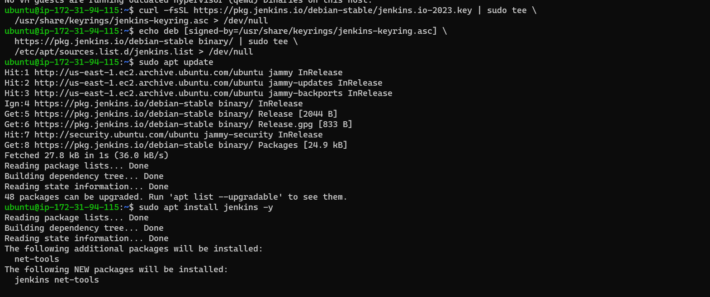

# Jenkins
* Jenkins is an open source continuous integration/continuous delivery and deployment (CI/CD) automation software DevOps tool written in the Java programming language. It is used to implement CI/CD workflows, called pipelines.
# Story of Jenkins

# Need for Continuous Integration
* Traditional Software Project Lifecycle

* Big Bang Integrations, were used by teams traditionally to combine components as each component was built by teams in isolation.

* Result of BigBang

# Continuous Integration (CI): 
* Continuous integration (CI) is the practice of `automating the integration of code changes from multiple contributors into a single software project.` It's a primary DevOps best practice, allowing developers to frequently merge code changes into a central repository where builds and tests then run.
* In this we integrate all the components of the application from day 1. Ideally whenver developer pushes the code to remote repository we need to perform integration.
* To check whether CI is successful or not a small set of automated tests were developed i.e.
  * We build all the application components
  * Integrate them and run this small set of tests which checks basic functionality of the system (Smoke Tests)
* Developers have started writing unit tests (test code which tests the application code)
* To measure the accuracy of unit tests generally we need a tool which measures coverage i.e. code coverage
* Code Coverage: Generally these are measure by tools
  * Line Coverage: Line coverage is a basic version of test coverage. When a test suite is run, code coverage records which lines of code were hit. Line coverage, thus, is the total number of lines run divided by the number of lines in the codebase.
  * branch coverage: how many of the branches of the control structures (if statements for instance) have been executed. 
  * symbol Coverage: The Business Auto Policy uses numeric symbols to indicate the types of vehicles for which coverage is in effect. Only those symbols listed for a coverage can be used. Symbols 1 through 6 provide vehicle automatic coverage. Symbol 1 includes Hired and Non-Owned auto coverage.
* To verify the quality of code and whether it suits your organization’s coding standards, Code Reviews are conducted.
* For coding standards and best practices we can use tools. The failures represented by these tools are generally referred as
  * Technical debt: he implied cost incurred when businesses do not fix problems that will affect them in the future. Accruing technical debt causes existing problems to get worse over time. The longer debt builds up, the more costly it becomes to rectify.
  * Code Smell: A maintainability issue that makes your code confusing and difficult to maintain.
* The tool for running tests is called as test harness tool or popularly know as __test runners__. For running unit tests
  * junit (java)
  * pytest (python)
  * jasmine (nodejs)
  * nunit (c-sharp)
* To check code coverage and code qualilty we have a tool which are generally referred as Static Code Analysis Tools. We will be using __Sonar Qube__ We need a tool which whenever a code is pushed to vcs, builds the code, runs the unit tests and also generates __Static Code Analysis__ report. These tools are referred as CI/CD Engines. 
* Some of the popular CI/CD Engines are
  * Jenkins
  * Azure DevOps Pipelines
  * Travis CI
  * Team City
  * Bamboo
# Build and Artifact
* Build represents a format/package into which your application code is transformed to run on enduser systems.
* To Generate Package we need to perform certain steps
    * compile
    * package
# Building Java
* To make it simple to build java code , Apache foundation has created a tool called as Ant
* In __Ant__ we configure the build using build.xml Refer Here
* Then a tool called as Maven was released which can perform
    * build
    * packaging
    * dependency management
    * documenation
* Maven goes with Convention over Configuration and all of them are around a file which is referred as pom.xml (project object model)
* Maven has a lifecycle
    * validate
    * compile
    * test
    * package
    * install
    * deploy
    * clean
* Every CI/CD Engine is Cron on steriods
# Dependencies
* All the development projects depend on external libraries
    * Java: maven packages
    * node js: npm packages
    * python: pip packages
    * dotnet: nuget packages
* There is a need for managing dependencies
# Installing Maven
* **Maven:** Maven is a popular open-source build tool developed by the Apache Group to build, publish, and deploy several projects at once for better project management. The tool provides allows developers to build and document the lifecycle framework.
* Maven helps developers manage Java-based apps through projects that organize and handle code files & build scripts to execute and run compiler tools, version no. for compiled code, plus dependency management that allows one project to reference a version of other projects.
* To install Maven java to be installed
# Setting Environmental Variables 
* Install java and Check the java by run below commands
```
sudo apt update
sudo apt install openjdk-11-java -y
java -version
whereis java
```


* Changing environmental variable from jdk-17 to jdk-11

* Maven install
```
sudo apt update
sudo apt install maven -y
mvn --version
```


* Maven will download all the necessary dependencies to compile/package/test from a maven central repository url@https://mvnrepository.com/repos/central and it downloads to M2_HOME which is by default `<HOME-DIR>/.m2` which is referred as local repository.
    * Maven Lifecycle Phases
    * compile: Will create .class files
    
    * test: will run unit tests
    * package: will create package (jar/war)
    * install: will copy the project which you have build to the local repository. Along with jar/war files a pom also gets copied.
    
    * clean: It will remove all the packages 
    
    
# game-of-life 
* GitHub url@https://github.com/wakaleo/game-of-life.git clone the url into your machine
* build the maven package `mvn package and mvn install`


* To run the application `mvn jetty:run`


# Jenkins installation
* Jenkins is an open source CI/CD Engine.
* Jenkins:
* Using Package managers on Linux
    Docker
    Windows
    WAR
* Lets install Jenkins Refer Here url@https://www.jenkins.io/doc/book/installing/linux/
* Lets install LTS (Long Term Support Version)
```
curl -fsSL https://pkg.jenkins.io/debian-stable/jenkins.io-2023.key | sudo tee \
  /usr/share/keyrings/jenkins-keyring.asc > /dev/null
echo deb [signed-by=/usr/share/keyrings/jenkins-keyring.asc] \
  https://pkg.jenkins.io/debian-stable binary/ | sudo tee \
  /etc/apt/sources.list.d/jenkins.list > /dev/null
sudo apt-get update
sudo apt-get install jenkins -y
```


* To access the jenkins `http://<ip_adddress>:8080`

* Click on install suggested plugins


# First Project to display some system information
* Lets create a Jenkins project which displays
* username
* current working directory
* java version
* all the environmental variables
* Lets start by create a Jenkins project (Freestyle)


